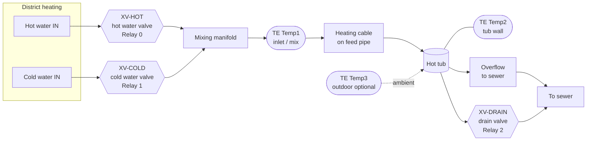
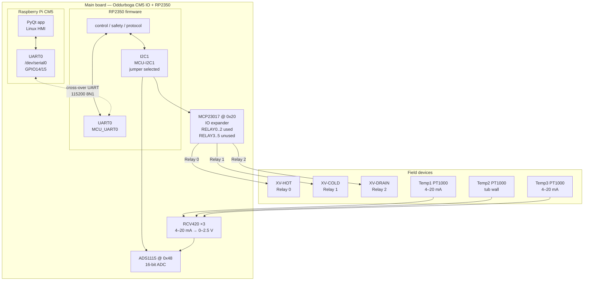
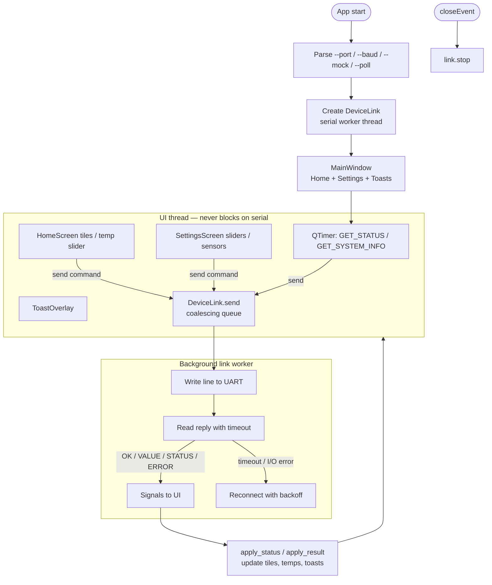
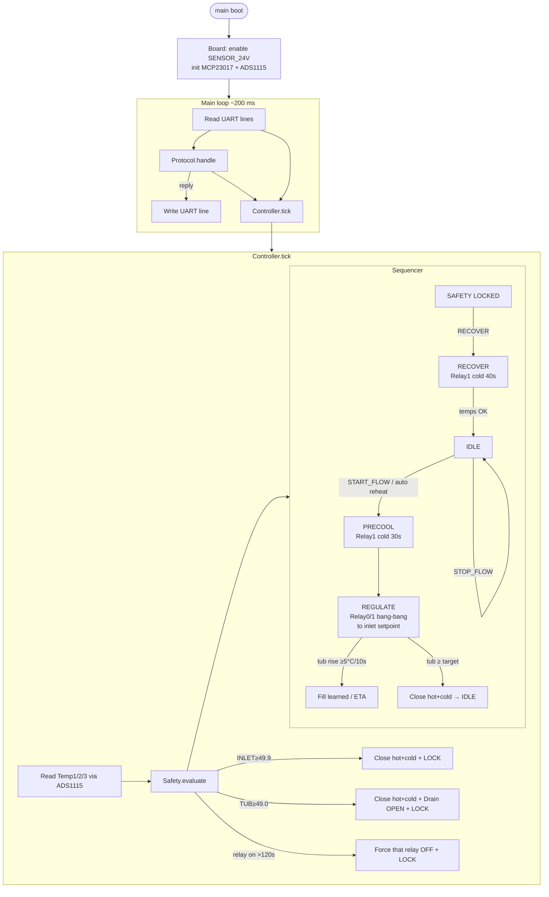
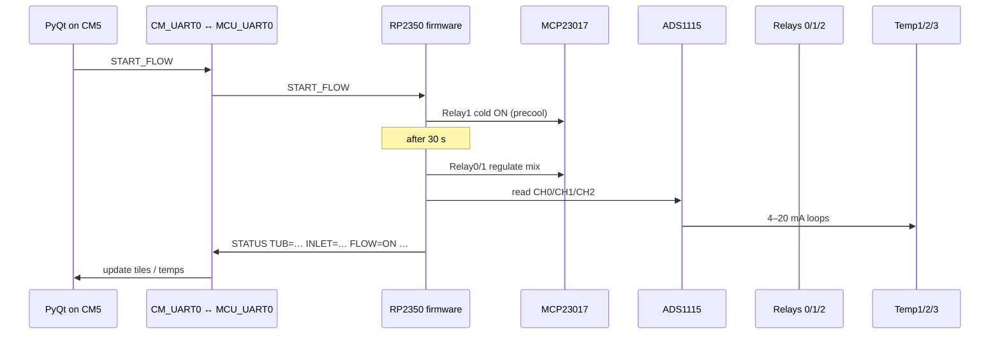

# System architecture diagrams

Mermaid diagrams for GitHub rendering. Symbols follow common automation /
P&ID-style naming where Mermaid allows (valves, sensors, controllers).

Relay assignment (production):

| Relay | Valve |
|-------|--------|
| **0** | Hot water valve |
| **1** | Cold water valve |
| **2** | Drain valve |
| 3–5 | Unused |

Inlet “flow” is logical (`START_FLOW` / `STOP_FLOW`): water enters when the
hot and/or cold valve is open. There is no separate flow relay.

---

## 1. Water system (P&ID-style)

**Legend:** `TE` = temperature element · `XV` = valve · cylinder = vessel/tub

Temp2 is a tub-wall probe. Overflow is a separate outlet to sewer — not the Temp2 location.

---

## 2. Electrical system (plant ↔ main board ↔ CM5 / RP2350)

**Co-work mode:** I2C jumper → **MCU-I2C1** (RP2350 owns expander + ADC). CM5 uses UART only.

---

## 3. PyQt app algorithm

**Mapping (home tiles → UART):**

| Tile | Off → On | On → Off |
|------|----------|----------|
| Power | `SET_MODE AUTO` | `SET_MODE OFF` |
| Flow | `START_FLOW` | `STOP_FLOW` |
| Drain | `SET_DRAIN OPEN` | `SET_DRAIN CLOSE` |
| Cold | `SET_MODE COLD` | `SET_MODE AUTO` |

---

## 4. RP2350 firmware algorithm

**Soft-start note:** `START_FLOW` opens **Relay 1 (cold)** for 30 s first, then bang-bang regulates with Relay 0 (hot) / Relay 1 (cold). Hot and cold are never on together.

---

## 5. End-to-end data path (summary)

