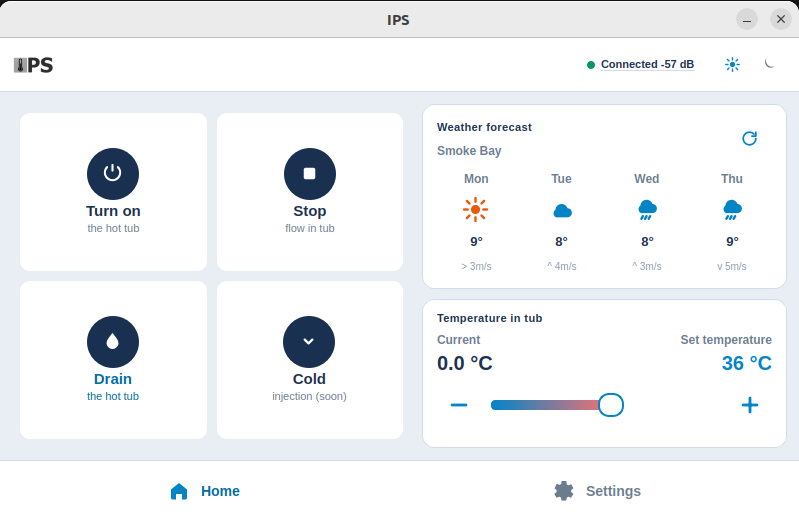
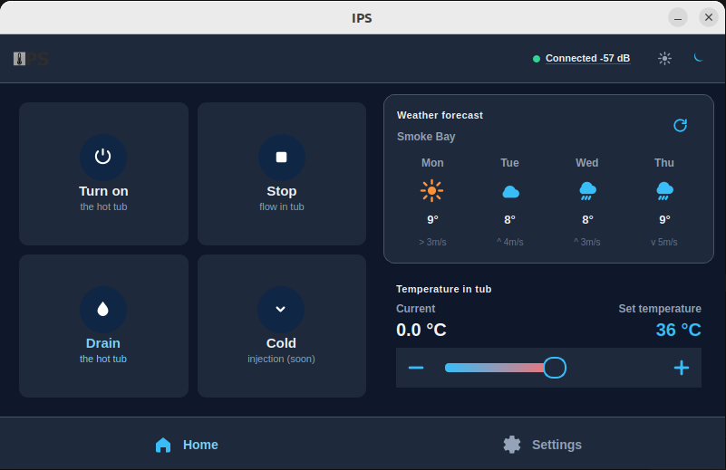
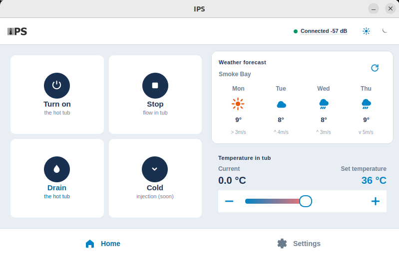
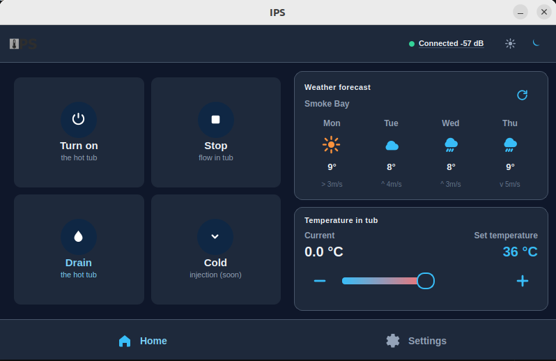
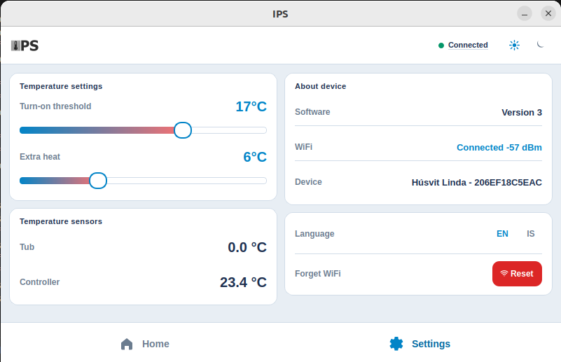
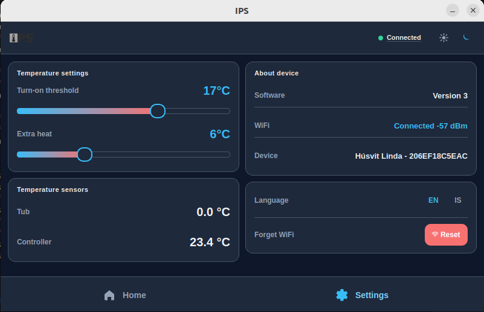
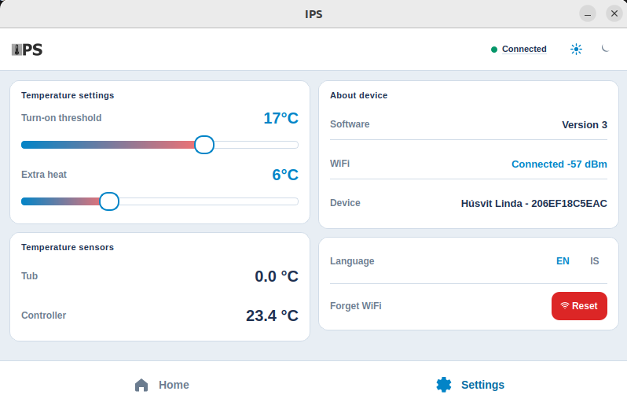
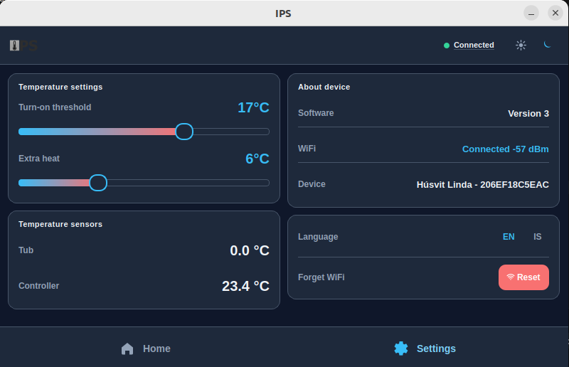

# IPS User Guide

IPS is the touchscreen interface for your hot-tub controller. Use it to start and stop the tub, set the water temperature, check the weather forecast, and adjust system settings.

This guide walks through every screen and control. Screenshots are shown at **800×480** (the default panel size) and **1024×600** where the layout differs.

---

## Table of contents

1. [Overview](#overview)
2. [Navigation](#navigation)
3. [Header bar](#header-bar)
4. [Home screen](#home-screen)
5. [Settings screen](#settings-screen)
6. [Language](#language)
7. [Light and dark theme](#light-and-dark-theme)
8. [Saved settings](#saved-settings)

---

## Overview

The app has two main screens:

| Screen | Purpose |
|--------|---------|
| **Home** | Day-to-day control — turn the tub on or off, drain, set temperature, view weather |
| **Settings** | Thresholds, sensor readings, device info, language, and WiFi reset |

### Home — light theme (800×480)

### Home — dark theme (800×480)

### Home — light theme (1024×600)

On a larger display the same controls are spread out with more room for touch targets.

### Home — dark theme (1024×600)

---

## Navigation

A bar at the bottom of every screen lets you switch between **Home** and **Settings**. The active tab is highlighted in blue.

| Button | Action |
|--------|--------|
| **Home** | Return to the main control screen |
| **Settings** | Open configuration and device information |

Tap the tab you want — there is no back button; use the bottom bar to move between screens.

---

## Header bar

The top bar appears on every screen.

| Element | Description |
|---------|-------------|
| **IPS logo** | Branding (top left) |
| **Connection status** | Green/red indicator for the controller link (and WiFi when shown), e.g. `Connected` or `Simulated` |
| **Theme toggle** | Sun icon = light theme, moon icon = dark theme. Tap to switch. |

If the connection indicator shows a problem, check that the controller is powered and the UART link (or mock mode) is available.

---

## Home screen

The home screen is split into a **left action grid** and a **right information panel**.

### Quick actions (left)

Four large tiles are independent toggles. The background shows whether the
feature is on; the title shows what the next tap will do. State is reconciled
from the controller (`GET_STATUS`), not only from the last tap.

| Button | Tap while off | Tap while on |
|--------|---------------|--------------|
| **Turn on / Turn off** | Start automatic fill/mix/maintain | Stop automatic control |
| **Start / Stop** | Start mixed-water inlet flow | Stop inlet flow (tub stays filled) |
| **Drain / Close drain** | Open the drain valve to sewer | Close the drain valve |
| **Cold / Auto** | Prefer cold injection | Return to normal auto mode |

Each tile shows a short subtitle under the title so you can confirm the action before tapping.

### Weather forecast (top right)

Shows a four-day outlook for your configured location (e.g. *Smoke Bay* in English, *Reykjavík* in Icelandic).

| Column | Meaning |
|--------|---------|
| Day | Weekday abbreviation (Mon–Thu) |
| Icon | Sun, cloud, or rain |
| Temperature | Forecast high in °C |
| Wind | Speed and direction (e.g. `> 3m/s`) |

Tap the **refresh** icon (↻) in the top-right corner of the weather card to request an updated forecast.

### Temperature in tub (bottom right)

Control the target water temperature and flow mode.

| Control | Description |
|---------|-------------|
| **Current** | Live water temperature read from the tub sensor (°C) |
| **Set temperature** | Your desired target temperature (°C) |
| **− / slider / +** | Lower or raise the set temperature. Drag the slider or tap the step buttons. Range: **20–50 °C** |
| **Flow mode** | Choose how the pump runs: **Continuous**, **Medium**, or **Low flow** |

Changes to set temperature and flow mode are saved automatically and restored the next time you open the app.

---

## Settings screen

Open **Settings** from the bottom navigation bar.

### Settings — light theme (800×480)

### Settings — dark theme (800×480)

### Settings — light theme (1024×600)

### Settings — dark theme (1024×600)

The settings screen has four sections arranged in two columns.

### Temperature settings (top left)

Fine-tune reheating and inlet heat-loss compensation. Ranges match the
controller API (1–5 °C).

| Slider | Range | Purpose |
|--------|-------|---------|
| **Reheat margin** | 1–5 °C | How far the tub may fall below target before automatic reheating resumes |
| **Inlet offset** | 1–5 °C | How much hotter mixed inlet water should be than the tub target (pipe heat loss) |

Drag each slider to adjust. The current value is shown on the right in large text. Changes are saved automatically and sent to the controller.

### Temperature sensors (bottom left)

Read-only values from the physical sensors on the installation:

| Reading | Source |
|---------|--------|
| **Tub** | Temp 1 — calibrated hot-tub water temperature |
| **Inlet** | Temp 2 — mixed water after the motorized valve |
| **Outdoor** | Temp 3 — optional outdoor ambient sensor |

These update from controller status when the serial link is connected.

### About device (top right)

| Field | Description |
|-------|-------------|
| **Software** | Installed firmware / application version |
| **WiFi** | Current network connection and signal strength |
| **Device** | Unique device name and identifier |

### Preferences (bottom right)

#### Language

Tap **EN** for English or **IS** for Icelandic. The entire interface updates immediately, and your choice is remembered on next launch.

#### Forget WiFi

Tap the red **Reset** button to clear stored WiFi credentials. Use this when moving the controller to a new network or troubleshooting connectivity. After reset, you will need to configure WiFi again through your device's setup process.

---

## Language

Default language is **English**. To switch to Icelandic:

1. Open **Settings**
2. Under **Language**, tap **IS**
3. All labels, buttons, and navigation text change to Icelandic

To return to English, tap **EN**.

Supported languages: `EN` (English), `IS` (Íslenska).

---

## Light and dark theme

Tap the **sun** or **moon** icon in the header bar on any screen to switch themes.

| Icon | Theme |
|------|-------|
| ☀ Sun (highlighted) | Light — white cards on a light grey background |
| 🌙 Moon (highlighted) | Dark — navy cards on a dark background |

Your theme preference is saved and applied automatically the next time the app starts.

---

## Saved settings

The following choices are written to `config.json` in the project folder and restored on startup:

| Setting | Where changed |
|---------|----------------|
| Set temperature | Home → Temperature in tub |
| Flow mode (Continuous / Medium / Low flow) | Home → Temperature in tub *(local preference; not a controller command)* |
| Reheat margin | Settings → Temperature settings |
| Inlet offset | Settings → Temperature settings |
| Language | Settings → Language |
| Theme (light / dark) | Header bar |

Sensor readings, WiFi status, and device name come from the controller and are not edited through this interface.

---

## Need technical help?

For installation on a Raspberry Pi, display configuration, and developer setup, see [README.md](README.md).
